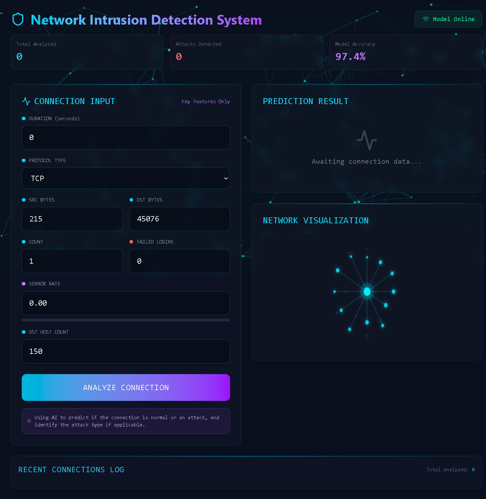

# 🛡️ Network Intrusion Detection System (NIDS)

A real-time network intrusion detection dashboard built with React + Vite. Analyzes network connection features and classifies traffic as normal or attack using an ML model (or mock data when offline).

## 📸 Screenshots

**Dashboard — Idle State**



**Dashboard — Attack Detected (Probe, 82.6% confidence)**


## 🚀 Getting Started

```bash
npm install
npm run dev
```

Open `http://localhost:5173` in your browser.

## ✨ Features

- **Real-time analysis** — input connection features and get instant predictions
- **Attack classification** — detects DoS, R2L, U2R, and Probe attacks
- **Confidence scores** — shows probability breakdown per attack type
- **Live network visualization** — animated canvas showing connection state
- **Activity log** — tracks the last 5 analyzed connections
- **Mock mode** — works without a backend using heuristic-based mock predictions

## 🧩 Tech Stack

- React 19 + Vite 8
- Tailwind CSS v4
- Framer Motion (via `motion`)
- Lucide React icons
- Axios

## ⚙️ Environment Variables

Create a `.env` file in the root:

```env
VITE_API_URL=http://localhost:5000/api   # Your backend URL
VITE_USE_MOCK=false                       # Set to true to force mock mode
```

By default, mock mode is **on** — no backend required.

## 📡 Backend API (Optional)

If connecting a real ML model, the backend should expose:

| Endpoint | Method | Description |
|----------|--------|-------------|
| `/api/predict` | POST | Returns prediction for connection features |
| `/api/status` | GET | Returns model status and version |
| `/api/history` | GET | Returns past predictions |

### Predict Request Body

```json
{
  "features": {
    "duration": 0,
    "protocol_type": "tcp",
    "src_bytes": 215,
    "dst_bytes": 45076,
    "count": 1,
    "num_failed_logins": 0,
    "serror_rate": 0.0,
    "dst_host_count": 150
  }
}
```

### Predict Response

```json
{
  "status": "attack",
  "attackType": "DoS",
  "confidence": 0.92,
  "attackProbabilities": {
    "DoS": 0.92,
    "R2L": 0.03,
    "U2R": 0.02,
    "probe": 0.03
  }
}
```

## 📁 Project Structure

```
src/
├── components/
│   ├── NetworkBackground.jsx   # Animated canvas background
│   ├── NetworkGraph.jsx        # Connection visualization
│   └── ActivityLog.jsx         # Recent connections log
├── data/
│   └── api.js                  # API client + mock data logic
├── App.jsx                     # Main dashboard
└── index.css                   # Global styles
```

## 🛠️ Scripts

```bash
npm run dev      # Start dev server
npm run build    # Production build
npm run preview  # Preview production build
npm run lint     # Run ESLint
```